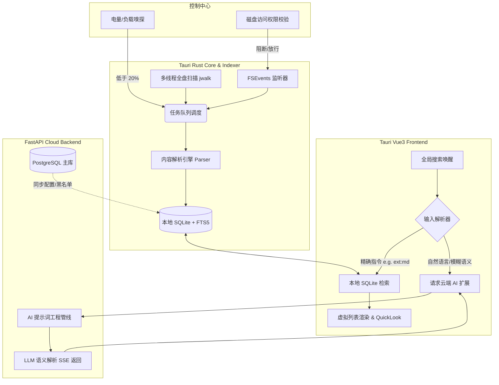

### 1. 核心架构设计与技术选型

#### 1.1 谋定而后动 (Think First)：核心假设与边界界定

* **假设 1：混合架构势在必行。** 虽然工具主打本地离线，但考虑到您未来极可能引入商业化订阅、AI 语义扩展或跨设备配置同步，系统必须采用 **Local (Tauri + SQLite) + Cloud (FastAPI + PostgreSQL)** 的 C/S 混合架构。
* **假设 2：双轨索引策略。** 针对 PM 提出的性能悖论，系统默认对全盘（排除系统黑名单）建立仅包含文件名的轻量索引；对用户高频交互的特定目录（如包含大型单机游戏存档的 `Steam` 目录，或导出豆瓣书影音记录的 `Markdown` 笔记库），采取“按需 Opt-in”的深度内容索引策略。

#### 1.2 技术选型与职责划分

* **大前端 (本地基座)：** `Tauri v2 + Vue 3 + TypeScript`。Tauri 的 Rust 后端负责对接 macOS原生 API (FSEvents、系统权限调度、多线程冷启动遍历)；Vue 3 配合无头 UI/Tailwind 构建毫秒级响应的 Raycast 风格界面。
* **云原生后端 (SaaS & AI)：** `FastAPI + Python + SQLModel`。负责处理云端用户鉴权、高级 AI 自然语言转查询指令 (NL2SQL/NL2DSL)、云端配置下发。
* **双数据库协同：**
* **本地端：** `SQLite (配合 FTS5 扩展)`，支撑极速的正则匹配与全文检索。
* **云端主库：** `PostgreSQL`，存储用户订阅状态、全局同义词库和云端配置项。

#### 1.3 核心流转架构图

#### 1.4 配置化数据结构设计 (Zero Hardcoding)

严禁在代码中写死扫描路径或正则，一切规则由本地 `SQLite` 中的配置表驱动，云端 `PostgreSQL` 可下发更新。

**核心表：`search_strategies` (检索规则字典表)**

| 字段名 | 类型 | 描述 | 示例值 (动态配置) |
| --- | --- | --- | --- |
| `rule_id` | String | 物理标识 (PK) | `rule_001_doc` |
| `target_ext` | JSON | 匹配后缀 | `[".md", ".txt", ".csv"]` |
| `enable_content_idx` | Boolean | 是否开启内容提取 | `true` |
| `priority_path` | JSON | 优先扫描的高频路径 | `["~/Documents/Douban_Lists", "~/Library/Application Support/Steam"]` |
| `parser_type` | String | 挂载的解析器 | `text_parser` |
| `max_size_mb` | Integer | 文件大小阈值 | `50` (超过则回退为仅扫文件名) |

---

### 2. AI 模块与成本控制策略

为了将自然语言搜索（如“帮我找找上个月我写的关于架构设计的文档”）转化为精准的本地查询语法（如 `ext:md,pdf AND content:"架构设计" AND date:>30d`），后端需引入 AI 模块。

* **结构化 Prompt 管线：** 提示词严格与业务逻辑分离，存放在后端的 `/prompts/nl2dsl/v1.json` 中，强制 LLM 输出验证过 JSON Schema 的 DSL 结构。
* **SSE 流式响应降级：** 遇到复杂语义推理，FastAPI 强制使用 SSE 将中间状态（“正在分析意图...” -> “已生成查询条件”）推给 Vue3 前端，消除用户在 $\le 200ms$ 本地检索预期下的等待焦虑。
* **Token 优化与语义缓存 (Semantic Cache)：** 在 FastAPI 层引入本地向量缓存。若用户输入“上个月的设计图”与历史输入的“三十天内的架构图”向量相似度 $> 0.92$，直接返回缓存的 DSL 查询字符串，阻断大模型 API 调用，将单次 AI 请求成本降至零。

